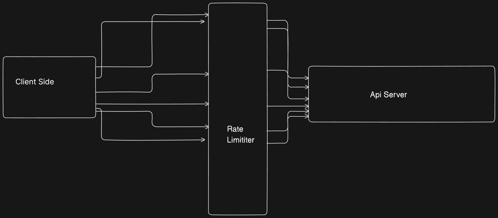

# ⏱️ Rate Limiter

This repository demonstrates how to implement a **Rate Limiter** using time-window-based logic. It helps protect APIs from overuse by limiting how often a user or IP address can hit an endpoint within a given time frame.

## 🚀 Features

- ⏳ Fixed and sliding window implementations
- 🌐 IP-based or token-based rate limiting
- 🔐 Middleware ready for Express.js
- 📈 Real-time feedback when limit is exceeded

---

## 🛠️ Tech Stack

- Node.js
- Express.js
- JavaScript (ES6+)

---

## 🧪 How It Works

```text
Client → Server
         ↳ Check if requests within the time window exceed limit
         ↳ Allow or reject request based on rules
````

---

## 🏁 Getting Started

### 1. Clone the Repo

```bash
git clone https://github.com/kawaljain/rate-limiter.git
cd rate-limiter
```

### 2. Install Dependencies

```bash
npm install
```

### 3. Run the Project

```bash
npm start
```

### 4. Run the Project

```bash
npm install
npm start

```
Now open http://localhost:{PORT}/ in your browser or hit it with Postman/cURL — after 10 requests in a minute, you’ll get a 429 Too Many Requests response.

### 5. Test It

Send multiple requests using a tool like Postman or cURL to `http://localhost:{PORT}/`.

---

## 📌 Use Cases

* Public API rate limiting
* Brute-force login protection
* Fair usage enforcement

---

## 🏗️ Architecture diagram



---

## 🙌 Contributing

Feel free to fork, improve, and raise PRs!
If you find it useful, give the repo a ⭐️!

---

## 🐛 Issues

Found a bug or want to request a feature?
Open an issue here: [https://github.com/kawaljain/rate-limiter/issues](https://github.com/kawaljain/rate-limiter/issues)

---

## 📄 License

Licensed under the **MIT License**. See [`LICENSE`](./LICENSE) for more details.
---

## 🧑‍💻 Author

**Kawal Jain**
🔗 GitHub: [@kawaljain](https://github.com/kawaljain)  
🌐 Website: [https://kawaljain.com](https://kawaljain.com)  
📝 Blog: [https://blog.kawaljain.com](https://blog.kawaljain.com)  
📝 Medium: [https://kawaljain.medium.com/](https://kawaljain.medium.com/)  
---


